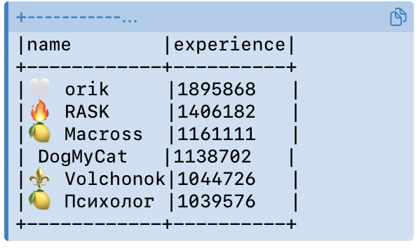
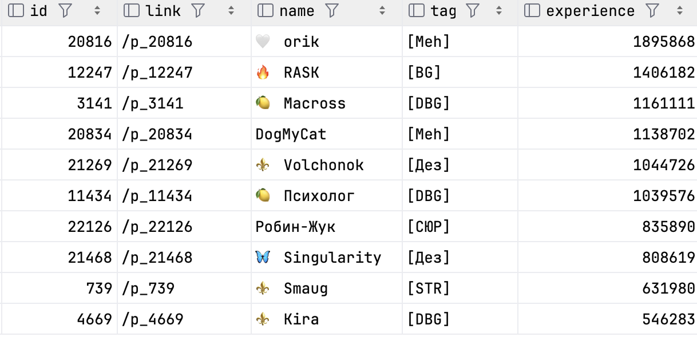
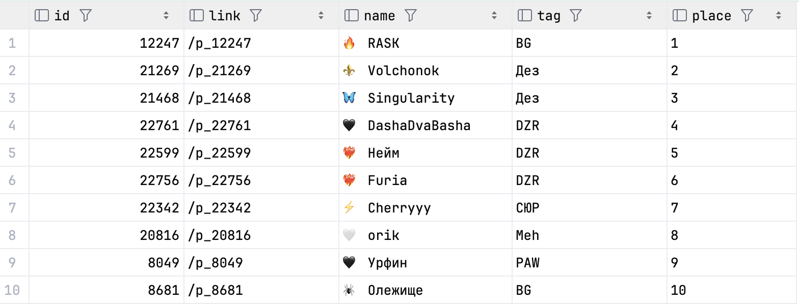
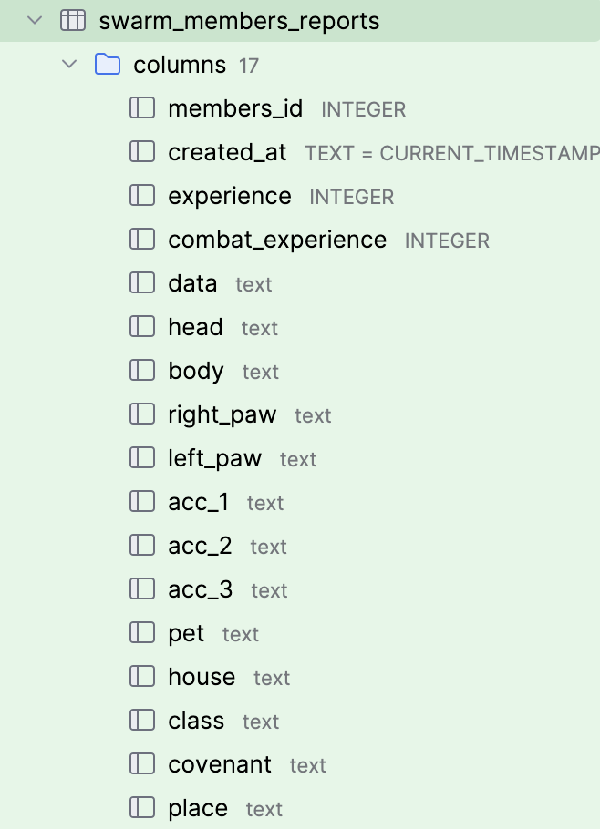

# DL PLAYING BOT

## CONFIG

[config.yaml](config.yaml)

Заполните файл данными полученными из
https://my.telegram.org/apps

```yaml
accounts:
  - name: _some_name_
    api_id: _some_api_id_
    api_hash: _some_api_hash_
```

## USING

* Рыбалка
    * `python dl/main.py -j fishing -a _some_name_`
* Атака
    * `python dl/main.py -j fighting -a _some_name_`
* Совместная атака на мобов
    * `python dl/main.py -j party -a _some_name_`
* Питомцы
    * 😸Погладить: `python dl/main.py -j terrarium -a _some_name_ -o stroke`
    * 🐾Прогулка: `python dl/main.py -j terrarium -a _some_name_ -o stroll`
* Различные калькуляторы
  * `python calc.py` [пример](example.md)
```
  1 |  Подсчет рыбы 
  2 |  Подсчет рыбы (прогресс)                                                                                                                                                                                   
  3 |  Подсчет рыбы (таблица)                                                                                                                                                                                   
  0 |  Выход  
                                                                                                                                                                                                     
  ┌─[Выбери]                                                                                                                                                                                                       
  ├──(1/2/3/./0)-[~/Settings]                                                                                                                                                                                        
  └─$ 0                                                                                                                                                                                                            
  ℹ️  Exit
```

Для построения таблицы заполни файл [fishings.json](data/fishings.json)

```json
{
  "23.07.2026": "_инвентарь_",
  "28.07.2026": "_инвентарь_",
  "31.07.2026": "_инвентарь_",
  "01.08.2026": "_инвентарь_",
  "02.08.2026": "_инвентарь_"
}
```

* Статитстика стай
  * `python dl/swarms.py`



